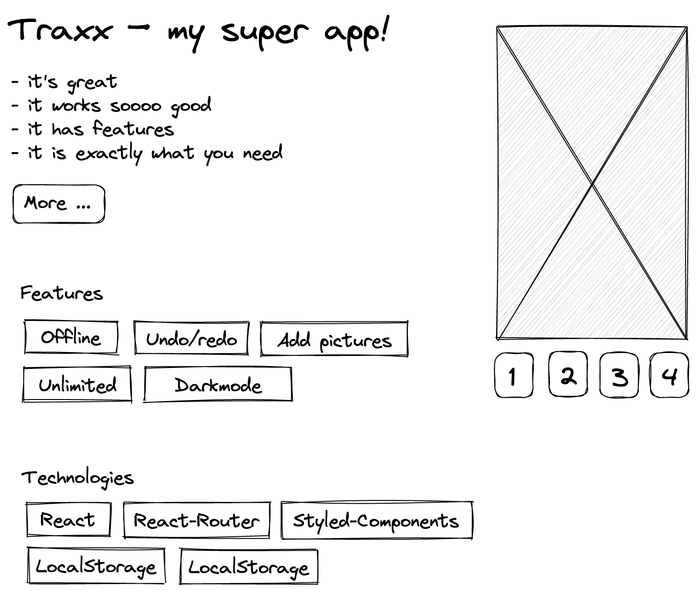

# Astro workshop

---
<!-- _class: tags block -->

## Zeitplan

| Zeit  | Phase                              |
| ----- | ---------------------------------- |
| 10:00 | Warum neues Format?                |
| 10:05 | Aktives Lernen, Aktives Lesen      |
| 10:25 | Aufgabenbesprechung                |
| 10:35 | Talk: Einführung in Astro          |
| 10:45 | Aktive Lernphase                   |
| 11:45 | Besprechen der Ergebnisse          |
| 12:00 | Kurze Feedbackrunde (je nach Zeit) |

---
<!-- _class: lead -->

# Warum neues Format?

---
<!-- _class: tags blocks -->
<!-- _footer: 10:00 - 10:05 -->

## Warum neues Format?

 * Fokus: Problemlösen
 * Jobnahe Aufgaben
 * Eigenes Lerntempo
 * Individuelle Betreuung
 * Stress reduzieren

---
<!-- _class: lead -->
<!-- _footer: (1/3) 10:05 - 10:25 -->

# Aktives Lernen, Aktives Lesen

---
<!-- _class: tags blocks -->

## Aktives Lernen, Aktives Lesen

 * Problemstellung als Startpunkt
 * Strukturiertes Arbeiten
 * Selbständiges Erarbeiten
 * Nachhaltiger Wissensaufbau
 * Ohne zeitlichen Stress
 * Single, Pairing, Group, Coach

---
<!-- _class: sublead tags -->
<!-- _footer: (2/3) 10:05 - 10:25 -->

# Aktives Lernen

---
<!-- _class: tags blocks -->

## Aktives Lernen

 * "Problembasiertes Lernen"
 * Carl Wieman (Nobelpreis)
 * **Jede(r)** kann so Komplexes erlernen
 * 4 Lerntypen sind Unsinn

---
<!-- _class: sublead tags -->
<!-- _footer: (3/3) 10:05 - 10:25 -->

# Aktives Lesen

---
<!-- _class: tags  -->

## Aktives Lesen

1) Problematik
2) Material
3) Überblick
4) Struktur
   * Notizen
   * Fragen
   * Takeaways
   * Links
5) Fragen klären
6) Ergebnisse teilen

---
<!-- _class: lead -->
<!-- _footer: 10:25 - 10:35 -->

# Aufgabe

---
<!-- _class: sublead -->
<!-- _footer: 10:25 - 10:35 -->
# Capstone Landingpage

---

---
<!-- _class: tags blocks -->
<!-- _footer: 10:25 - 10:35 -->

## Material

 * Projekt-Template
 * 2 Artikel
 * Notizen-Template
 * Kein Zeitlimit
 * Austausch nach 1 Stunde

---
<!-- _class: sublead -->

##  github.com/badabam/astro-workshop

---
<!-- _class: lead -->
<!-- _footer: 10:25 - 10:35 -->

# ASTRO

---
<!-- _class: tags -->
## Astro
* Erzeugt HTML-Seiten
* eigene statische Komponenten
* fremde dynamische Komponenten
* Insel-Architektur
* CSS Tooling

---
<!-- _class: sublead -->

## DEMO

---

<!-- _class: sublead -->

# Danke für eure Zeit!
